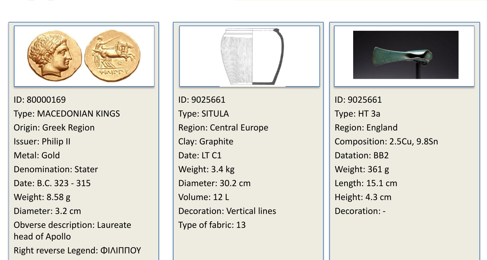
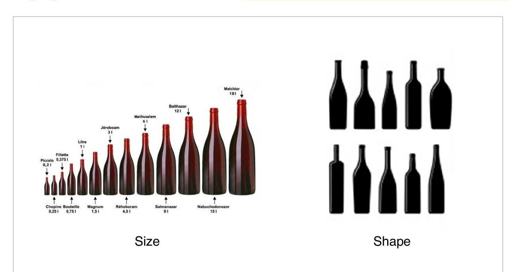
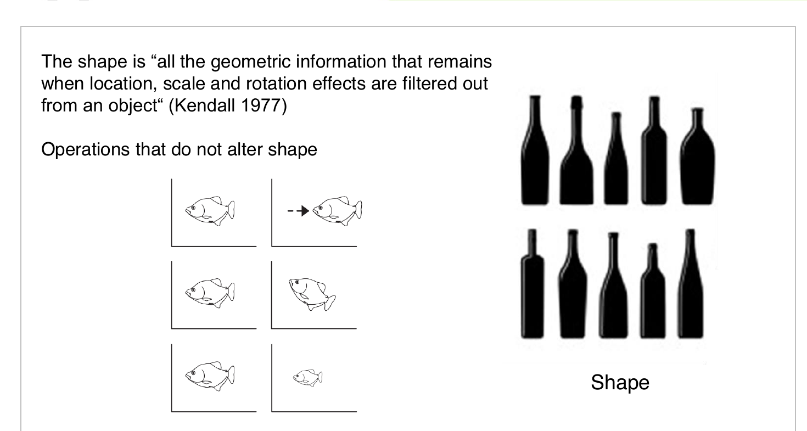
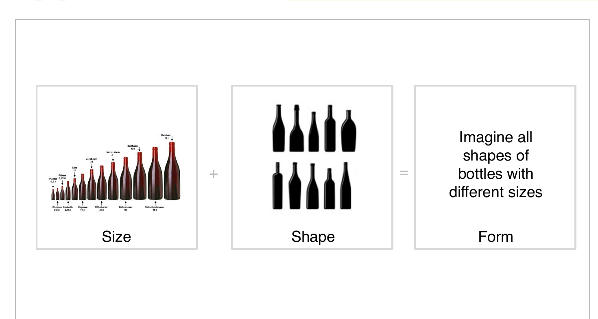

## מהי צורה? {.center}

> "כל חפץ שנוצר בידי אדם — יש לו צורה.
> הצורה אינה קישוט — היא מידע."

::: {.fragment}
מורפומטריה גיאומטרית (GM) היא השיטה המתמטית לכימות הצורה.
:::

---

## מה אנחנו חוקרים?

{fig-align="center" width="90%"}

---

## שלוש שאלות יסוד

::: {.incremental}
1. **מה** הצורה של החפץ — ואיך מדדים אותה בצורה מדויקת?
2. **למה** הצורה הזאת — ומה השפיע עליה?
3. **מה ניתן להסיק** מהשוואת צורות בין חפצים, אתרים, תרבויות?
:::

---

## גודל לעומת צורה

{fig-align="center" width="88%"}

::: {.fragment}
**גודל** (Size) — נפח, גובה, משקל. **צורה** (Shape) — היחסים הגיאומטריים, בלי קשר לגודל.
:::

---

## הגדרת צורה — קנדל 1977

{fig-align="center" width="88%"}

::: {.callout-note .fragment}
**הגדרה:** הצורה היא "כל המידע הגיאומטרי שנשאר לאחר שמסירים את השפעות המיקום, הגודל והסיבוב מהאובייקט" (Kendall 1977).
:::

---

## גודל + צורה = טיפוס

{fig-align="center" width="88%"}

---

## שלושה סוגי נתוני צורה

| סוג | שיטה | מתאים ל- |
|-----|------|----------|
| **ציוני דרך** (Landmarks) | נקודות מוגדרות על החפץ | עצמות, כלי אבן, מטבעות |
| **קווי מתאר** (Outlines) | עקומה סביב החפץ | כלי חרס, גרזנים |
| **משטחים** (Surfaces) | רשת 3D | גולגלות, כלי אבן |

::: {.fragment}
בקורס זה נעסוק בשני הראשונים — ציוני דרך וקווי מתאר.
:::

---

## תהליך ניתוח GM — סקירה

::: {.incremental}
1. **צילום / סריקה** — תמונה סטנדרטית של החפץ
2. **דיגיטציה** — סימון ציוני דרך או קו מתאר
3. **יישור** — הסרת גודל, מיקום וסיבוב (Procrustes)
4. **PCA** — מציאת ממדי השונות העיקריים
5. **פרשנות** — חיבור לשאלה הארכאולוגית
:::

---

## מדוע GM עדיפה על טיפולוגיה?

::: {.columns}
::: {.column width="50%"}
**טיפולוגיה מסורתית**

- מבוססת על שיפוט מומחה
- קטגורית (כן/לא)
- לא ניתנת לשחזור מלא
- קשה לבדיקה סטטיסטית
:::
::: {.column width="50%"}
**GM**

- מבוססת על מדידה
- רציפה (מספרים)
- ניתנת לשחזור מלא
- בדיקות סטטיסטיות מובנות
:::
:::

::: {.callout-tip .fragment}
GM אינה מחליפה את הארכאולוג — היא נותנת לו/לה כלים לבדוק השערות באופן אובייקטיבי.
:::

---

## קוד לדוגמה: ויזואליזציה של ציוני דרך {.smaller}

```python
import numpy as np
import matplotlib.pyplot as plt
from bidi.algorithm import get_display
rtl = get_display

# ציוני דרך של מטבע (x, y)
landmarks = np.array([
    [0.0, 1.0],   # קצה עליון
    [0.7, 0.7],   # ימין עליון
    [1.0, 0.0],   # ימין
    [0.7, -0.7],  # ימין תחתון
    [0.0, -1.0],  # קצה תחתון
    [-0.7, -0.7], # שמאל תחתון
    [-1.0, 0.0],  # שמאל
    [-0.7, 0.7],  # שמאל עליון
])

fig, ax = plt.subplots(figsize=(5, 5))
ax.scatter(landmarks[:, 0], landmarks[:, 1],
           c='red', s=100, zorder=5)
for i, (x, y) in enumerate(landmarks):
    ax.annotate(str(i+1), (x, y),
                textcoords="offset points", xytext=(5, 5))
ax.set_aspect('equal')
ax.set_title(rtl('ציוני דרך על מטבע'))
plt.show()
```

---

## לשיעור הבא

::: {.incremental}
- קראו: [מודול 1 — מהי צורה?](../modules/01-what-is-shape.qmd)
- התחילו: [מטלה 1 — יומן צורות](../assignments/01-shape-journal.qmd)
- בחרו **חפץ אחד** מהסביבה שלכם ותארו את צורתו במילים
:::

::: {.fragment .center}
### שאלות?
:::
