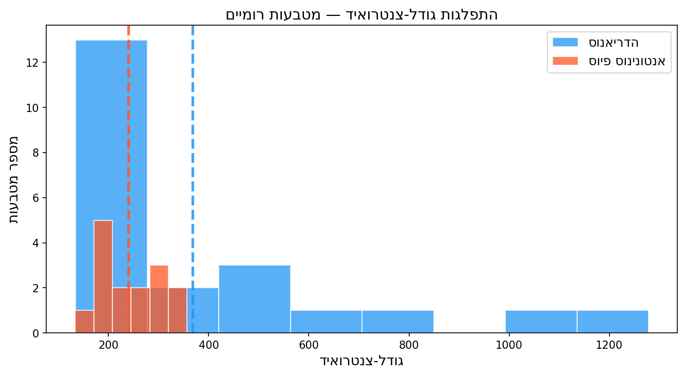
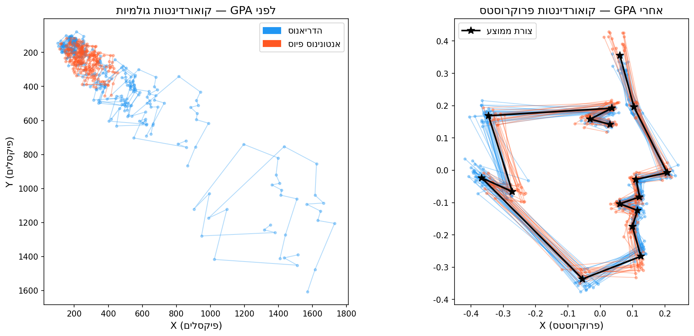
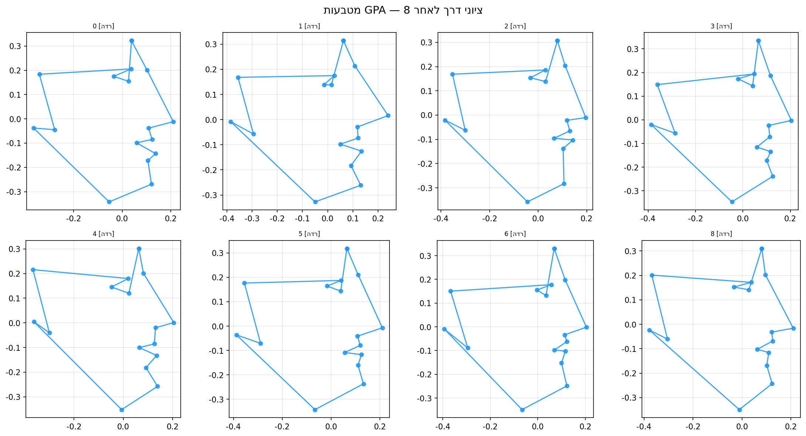

## הבעיה: איך משווים צורות? {.center}

שני מטבעות — אחד גדול פי שניים ומסובב ב-45°.

::: {.fragment}
**פתרון:** יישור פרוקרוסטס (GPA — Generalized Procrustes Analysis)

הסרת **גודל + מיקום + סיבוב** — ונשארת רק הצורה.
:::

---

## שלושה שלבי יישור

::: {.incremental}
1. **הזזה (Translation)** — מרכז הכובד של כל פרט ל-(0,0)
2. **קנה מידה (Scaling)** — גודל-צנטרואיד = 1 לכולם
3. **סיבוב (Rotation)** — מינימום סטייה מהממוצע
:::

::: {.callout-note .fragment}
התהליך **איטרטיבי**: מחשבים ממוצע → מיישרים → מחשבים שוב, עד להתכנסות.
:::

---

## גודל-צנטרואיד (Centroid Size)

$$CS = \sqrt{\sum_{i=1}^{k} \left[(x_i - \bar{x})^2 + (y_i - \bar{y})^2\right]}$$

{fig-align="center" width="85%"}

---

## GPA ב-Python (Colab)

```python
import numpy as np
from morphops import gpa

# landmarks.shape = (35, 16, 2) — 35 מטבעות, 16 ציוני דרך
landmarks = np.load("coins_landmarks.npy")

# יישור GPA — מחזיר מילון
result = gpa(landmarks)
aligned    = result['aligned']   # ציוני דרך מיושרים
mean_shape = result['mean']      # צורה ממוצעת

print(f"מספר מטבעות: {len(aligned)}")
print(f"ציוני דרך: {aligned.shape[1]}")
print(f"טווח x לאחר GPA: {aligned[:,:,0].min():.3f} עד {aligned[:,:,0].max():.3f}")
```

---

## תוצאה — לפני ואחרי GPA

{fig-align="center" width="90%"}

::: {.fragment}
שמאל: כל מטבע במיקום ובגודל שלו. ימין: כולם מיושרים — רק הצורה נשארת.
:::

---

## ציוני הדרך המיושרים

{fig-align="center" width="70%"}

::: {.fragment}
כל נקודה = ציון דרך אחד על מטבע אחד. הצבע = קיסר. הנקודה הלבנה = ממוצע.
:::

---

## מה שומרים לאחר GPA?

::: {.columns}
::: {.column width="50%"}
**נשמר:**
- הצורה היחסית
- יחסים בין ציוני דרך
- שונות הצורה בין פרטים
:::
::: {.column width="50%"}
**מוסר:**
- גודל מוחלט
- מיקום בחלל
- סיבוב
:::
:::

::: {.callout-tip .fragment}
גודל-צנטרואיד **נשמר בצד** לניתוח אלומטריה (קשר צורה-גודל) בנפרד.
:::

---

## לשיעור הבא — PCA

לאחר GPA: נתוני צורה מיושרים ב-32 ממדים (16 נקודות × x,y).  
השלב הבא: **הפחתת ממדים** → 2 צירים עיקריים.

::: {.fragment}
קראו: [מודול 5 — PCA ומרחב הצורות](../modules/05-pca.qmd)
:::
