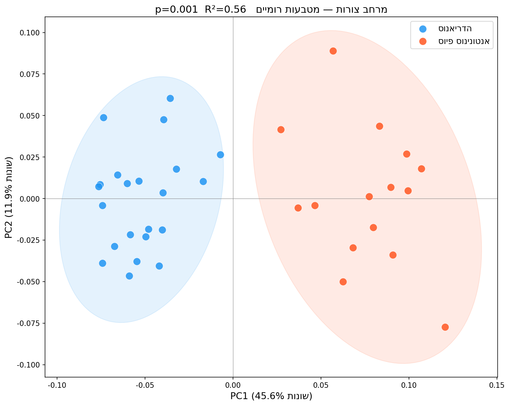
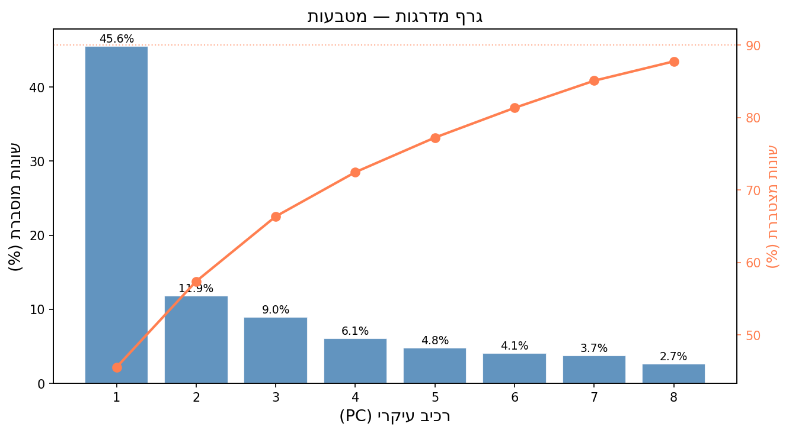

## PCA — למה? {.center}

אחרי GPA: לכל פרט יש **16 מספרים** (8 נקודות × x,y).  
אי אפשר להציג 16 ממדים בבת אחת.

::: {.fragment}
**PCA** (ניתוח רכיבים עיקריים) מוצא את **כיווני השונות הגדולים ביותר** ומאפשר הצגה דו-ממדית.
:::

---

## רכיב עיקרי (PC) — מה זה?

- **PC1** — הכיוון שמסביר הכי הרבה שונות
- **PC2** — הכיוון הניצב ל-PC1 שמסביר הכי הרבה מהשונות הנותרת
- וכן הלאה...

::: {.callout-note .fragment}
כל PC הוא **שינוי צורה** — תנועה לאורך הציר מראה כיצד הצורה משתנה בין קצות הסקאלה.
:::

---

## PCA ב-Python — מטבעות

```python
from sklearn.decomposition import PCA
import numpy as np
import matplotlib.pyplot as plt
from bidi.algorithm import get_display
rtl = get_display

# aligned.shape = (20, 8, 2) → שטחו ל-(20, 16)
X = aligned.reshape(len(aligned), -1)

# PCA
pca = PCA()
scores = pca.fit_transform(X)

# אחוזי שונות
var_explained = pca.explained_variance_ratio_ * 100
print(f"PC1: {var_explained[0]:.1f}%")
print(f"PC2: {var_explained[1]:.1f}%")
print(f"יחד: {var_explained[:2].sum():.1f}%")
```

---

## גרף פיזור (Scatter Plot) — מרחב הצורות

```python
fig, ax = plt.subplots(figsize=(8, 7))

# צביעה לפי קיסר (Hadrian vs Antoninus)
colors = ['#e07b39' if i < 10 else '#4a90c4' 
          for i in range(20)]
labels = ['הדריאנוס'] * 10 + ['אנטונינוס פיוס'] * 10

scatter = ax.scatter(scores[:, 0], scores[:, 1],
                     c=colors, s=80, alpha=0.8, 
                     edgecolors='white', lw=0.5)

ax.set_xlabel(rtl(f"PC1 ({var_explained[0]:.1f}% שונות)"))
ax.set_ylabel(rtl(f"PC2 ({var_explained[1]:.1f}% שונות)"))
ax.set_title(rtl("מרחב הצורות — מטבעות רומיים"))
ax.axhline(0, color='grey', lw=0.5, ls='--')
ax.axvline(0, color='grey', lw=0.5, ls='--')

from matplotlib.patches import Patch
legend = [Patch(fc='#e07b39', label=rtl('הדריאנוס')),
          Patch(fc='#4a90c4', label=rtl('אנטונינוס פיוס'))]
ax.legend(handles=legend)
plt.tight_layout()
plt.show()
```

---

## מרחב הצורות — תוצאות אמיתיות

{fig-align="center" width="85%"}

::: {.fragment}
שתי הקבוצות נפרדות בבירור לאורך PC1 — ההבדל בצורת הדיוקן.
:::

---

## גרף שדרה (Scree Plot)

{fig-align="center" width="80%"}

::: {.fragment}
PC1 לבדו מסביר את רוב השונות — המחלוקת בין הקיסרים ברורה.
:::

---

## קריאת גרף מרחב הצורות

::: {.incremental}
- **נקודות קרובות** = צורות דומות
- **נקודות רחוקות** = צורות שונות
- **כיוון PC1** = ציר השונות הגדול ביותר
- **ריכוז קבוצה** = אחידות יצור / בחירה
:::

::: {.callout-tip .fragment}
בדקו: האם הדריאנוס ואנטונינוס מופרדים? מה זה מסביר על יצור המטבעות?
:::

---

## גרידי הצורה (Deformation Grids)

```python
from morphops import tps_warp
import numpy as np

def plot_deformation(mean_shape, target_shape, ax, title):
    """מציג עיוות צורה בין ממוצע למטרה."""
    # רשת בסיס
    grid_x, grid_y = np.meshgrid(
        np.linspace(-0.5, 0.5, 10),
        np.linspace(-0.5, 0.5, 10)
    )
    grid = np.stack([grid_x.ravel(), grid_y.ravel()], axis=1)
    
    # עיוות TPS
    warped = tps_warp(mean_shape, target_shape, grid)
    warped = warped.reshape(10, 10, 2)
    
    for row in warped:
        ax.plot(row[:, 0], row[:, 1], 'b-', lw=0.5, alpha=0.5)
    for col in warped.T.reshape(10, 10, 2):
        ax.plot(col[:, 0], col[:, 1], 'b-', lw=0.5, alpha=0.5)
    ax.set_title(title)
```

---

## לשיעור הבא

מטלה 3 — ניתוח מטבעות — **מועד הגשה: שבוע 8**

::: {.incremental}
- הריצו את כל צינור העיבוד (TPS → GPA → PCA)
- הסבירו: האם שני הקיסרים נפרדים בצורת המטבע?
- קראו: [מודול 6](../modules/06-coins.qmd)
:::
