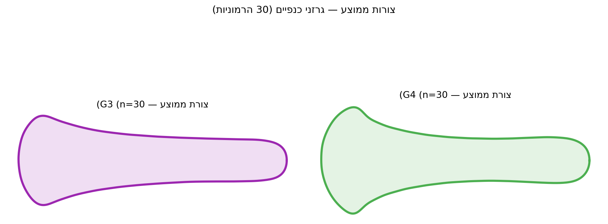

## מה אם אין ציוני דרך? {.center}

גרזן, צנצנת חרס, פגיון — **אין נקודות אנטומיות מוגדרות**.

::: {.fragment}
**פתרון:** ניתוח פורייה אליפטי (EFA)  
מתאר את הצורה כסכום של אליפסות מוצנבות זו בזו.
:::

---

## הרמוניות — הבנה אינטואיטיבית

::: {.incremental}
- **הרמוניה 1** — האליפסה הגדולה (צורה כללית)
- **הרמוניה 2** — שיפור ראשון (מוסיף פרטים)
- **הרמוניה 3–5** — פרטים עדינים
- **הרמוניה 6–20** — פרטים עדינים מאוד
:::

::: {.callout-note .fragment}
20 הרמוניות → 80 מקדמי EFA לכל פרט.  
אלה הנתונים שנכנסים ל-PCA.
:::

---

## חילוץ קו מתאר מ-PNG

```python
import numpy as np
from PIL import Image
from skimage import measure

def extract_outline(image_path):
    """חולץ את קו המתאר החיצוני מתמונת סילואט."""
    # פתיחה והמרה לגווני אפור
    img = np.array(Image.open(image_path).convert('L'))
    
    # סף בינארי: כהה = חפץ
    binary = img < 128
    
    # מציאת קווי מתאר
    contours = measure.find_contours(binary.astype(float), 0.5)
    
    if not contours:
        return None
    
    # הכי גדול = קו המתאר של החפץ
    return max(contours, key=len)

# בדיקה
outline = extract_outline("data/axes/G3/ax001.tif")
print(f"נמצאו {len(outline)} נקודות בקו המתאר")
```

---

## חישוב מקדמי EFA

```python
import pyefd

def compute_efa(image_path, n_harmonics=20):
    """מחשב מקדמי EFA מתמונה."""
    outline = extract_outline(image_path)
    if outline is None:
        return None
    
    y, x = outline[:, 0], outline[:, 1]  # skimage: (שורה, עמודה)
    
    # EFA עם נרמול (גודל + סיבוב + נקודת התחלה)
    coeffs = pyefd.elliptic_fourier_descriptors(
        np.column_stack([x, y]),
        order=n_harmonics,
        normalize=True
    )
    return coeffs.ravel()  # וקטור של 80 מספרים

# עיבוד כל הגרזנים
import os
records = []
for fname in os.listdir("data/axes/G3"):
    if fname.endswith(".tif"):
        c = compute_efa(f"data/axes/G3/{fname}")
        if c is not None:
            records.append({"file": fname, **{f"e{i}": v
                           for i,v in enumerate(c)}})
```

---

## שחזור צורה מ-EFA

```python
import matplotlib.pyplot as plt

def reconstruct_shape(coeffs, n_harmonics=20, n_points=300):
    """משחזר קו מתאר ממקדמי EFA."""
    coeffs_2d = coeffs.reshape(n_harmonics, 4)
    t = np.linspace(0, 1, n_points)
    x = np.zeros(n_points)
    y = np.zeros(n_points)
    
    for n, (a, b, c, d) in enumerate(coeffs_2d, 1):
        phi = 2 * np.pi * n * t
        x += a * np.cos(phi) + b * np.sin(phi)
        y += c * np.cos(phi) + d * np.sin(phi)
    
    return x, y

# השוואה: 5 הרמוניות לעומת 20
fig, axes = plt.subplots(1, 2, figsize=(12, 5))
for ax, h, title in zip(axes, [5, 20], 
                          ["5 הרמוניות", "20 הרמוניות"]):
    sample_coeffs = records[0]  # גרזן ראשון
    c5 = np.array([sample_coeffs[f"e{i}"] for i in range(h*4)])
    x, y = reconstruct_shape(c5, h)
    ax.plot(x, y, 'b-', lw=2)
    ax.set_aspect('equal')
    ax.set_title(title)
plt.tight_layout()
plt.show()
```

---

## שחזור EFA — תוצאות אמיתיות

{fig-align="center" width="90%"}

::: {.fragment}
12 הרמוניות מספיקות לתיאור כמעט מושלם של צורת הגרזן.
:::

---

## לשיעור הבא

EFA על גרזני ברונזה — **מטלה 4** פתוחה.

::: {.incremental}
- הריצו את צינור ה-EFA על קבוצות G3 ו-G4
- בצעו PCA על המקדמים
- בדקו: האם הקבוצות נפרדות?
- קראו: [מודול 8](../modules/08-axes.qmd)
:::
